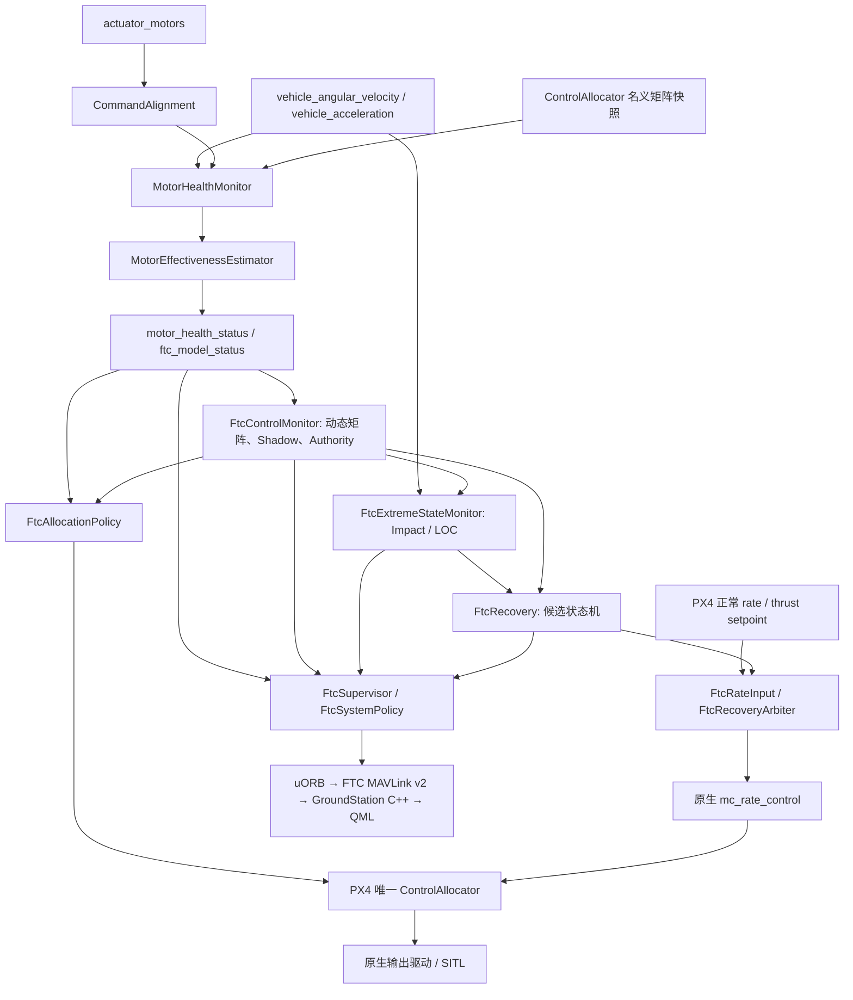

# FTC 当前架构与验证边界

源码基准：`d4c3972f68b5d1ee2d890980751179c84ac2eb89`。本页依据源码复核整理；本轮实际证据见 [验证报告](../testing/FTC_FULL_VALIDATION_REPORT.md)。默认 `FTC_CA_EN=0`、`FTC_REC_ACT=0`、`FTC_SIM_EN=0`。估计器尚未通过稳定的真实 SITL 准入检查。

| 部分 | 责任与当前边界 |
| --- | --- |
| 输入与对齐 | `actuator_motors` 命令历史与 IMU 响应时间对齐；默认延迟 40 ms，重复响应、未对齐、饱和与控制残差进入估计门。 |
| Effectiveness | 同样滤波命令及角加速度，移除慢变均值；三轴名义力矩形成多输出 RLS 回归。健康 Baseline 学习每轴增益，之后估计各电机 λ。 |
| λ | 当前是作用于名义 B 矩阵整列的无量纲乘数，统一缩放该旋翼的推力与三个转动力矩。这是近似，未分别辨识推力与偏航效率。 |
| 可观测性与质量 | 激励幅值与回归信息矩阵条件决定是否更新；sigma 来自协方差及残差放大，confidence 由 sigma 映射。confidence 是质量评分，不是校准后的故障概率。age 表示距上次更新的时间，不能替代 `last_valid_timestamp`。 |
| Health / Fault | Health 使用有效 λ；退化/失效门含持续时间。ESC 可辅助停转、供电/电调故障判断。全机振动及单一 λ 不再用于断言某片桨损伤或某个电机机械不平衡。 |
| 动态矩阵与 Shadow | `B_dynamic[:,i]=B_nominal[:,i]*λ_i`；使用 PX4 Sequential Desaturation 求候选输出与残差。Shadow 不发布实际电机命令。 |
| Authority | 汇总各轴正/负方向电机余量，以及向上/向下推力；方向余量不等同于全轴耦合约束下的可达集合。名义矩阵是结构变更快照，不是周期传感器消息。 |
| Active Allocation | 在原生 allocator 内应用门控 λ；要求模型、sigma、age、authority、机型、解锁与着陆状态均合格。软失效回到名义矩阵，着陆、上锁或不支持结构直接清除适配状态。 |
| Impact / LOC | Impact 结合加速度、jerk、转动与速度变化；LOC 结合跟踪误差、角速度、饱和、控制裕度及垂直运动。并非只凭倾角判断。 |
| Recovery | 候选阶段包含角速度抑制、推力方向、姿态、垂直速度、高度稳定、重新交接及紧急下降。资格不足时不发布有效候选；非法垂直输入现已被拒绝。 |
| 控制归属 | Recovery 只通过原生 rate 控制器入口仲裁 setpoint；Allocation 只改变底层矩阵。两条路径没有新增竞争性的执行器 publisher。是否动态稳定、是否引发积分器冲突仍须 Active 日志验证。 |
| Fallback / Re-entry | 仲裁限制候选与混合权重，等待正常 setpoint 匹配、持续稳定及退出反馈。正常输入出现 NaN 时立即释放 FTC 权重；正常输入自身的失效处理仍由 PX4 控制链负责，FTC 不制造替代正常指令。 |
| Supervisor | 生产状态逻辑集中在 `FtcSystemPolicy.hpp`。故障优先于普通退化；仅在有新鲜有效 Shadow 时报告 SHADOW；关闭参数后的退出混合期仍报告真实 Active 归属。 |
| Mass / Inertia / CG | 质量仅在独立推力标定及观测条件满足时计算，不反馈控制。`FTC_THR_MAX=0` 时无有效质量估计。惯量为配置值，CG 未实现可靠在线辨识，均不报告有效在线估计。 |
| GroundStation | 实际解码 v2，分别显示消息未收到、消息过期、模型不可用、不可观测和有效估计；无效 H/E 使用 N/A，历史数值另存。 |

两仓协议 XML 及生成头对应四类消息：60000 MOTOR、60001 CONTROL、60002 EXTREME、60003 DIAGNOSTICS。11 个 FTC uORB topic 在本轮 7 次飞行 ULog 中均存在。

旧文档作为历史证据保留。本轮按用户收尾要求停止进一步开发，原计划的全部专题文档拆分尚未完成；不能把历史方案中的 Active 目标当作当前验证结果。
